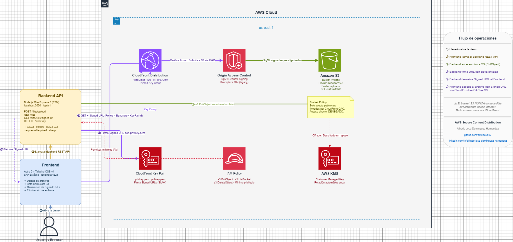

# AWS Secure Content Distribution

Arquitectura de distribución de contenido privado sobre AWS usando **CloudFront**, **S3 privado**, **Origin Access Control (OAC)**, firma **SigV4** y **Signed URLs** con expiración gestionadas por el backend.

> Demo funcional para probar la arquitectura en producción: subida de documentos e imágenes, y generación de URLs seguras con tiempo de expiración configurable.

---

## Tabla de contenidos

- [Descripción general](#descripción-general)
- [Arquitectura](#arquitectura)
- [Stack tecnológico](#stack-tecnológico)
- [Estructura del proyecto](#estructura-del-proyecto)
- [Requisitos previos](#requisitos-previos)
- [Configuración del entorno](#configuración-del-entorno)
- [Instalación y ejecución](#instalación-y-ejecución)
- [API Reference](#api-reference)
- [Infraestructura (Terraform)](#infraestructura-terraform)
- [Decisiones de arquitectura](#decisiones-de-arquitectura)
- [Estado del proyecto](#estado-del-proyecto)
- [Seguridad](#seguridad)
- [Licencia](#licencia)

---

## Descripción general

Este proyecto implementa un sistema de **distribución de contenido privado** donde los archivos en S3 nunca son accesibles públicamente. El acceso se controla mediante **Signed URLs** de CloudFront que expiran en un tiempo determinado.

**Problema que resuelve:** entregar archivos privados (PDFs, imágenes, documentos) de forma segura a usuarios autorizados, sin exponer el bucket S3 ni sus objetos directamente.

**Solución:** CloudFront actúa como única puerta de entrada. El backend genera Signed URLs firmadas con una clave privada. CloudFront verifica la firma antes de servir el contenido desde S3 a través de OAC (SigV4).

---

## Arquitectura



```
┌──────────────┐        Signed URL         ┌─────────────────┐
│   Frontend   │ ─────────────────────────▶│    Backend API   │
│  (Browser)   │ ◀──── URL firmada (exp) ──│  (Node/Express)  │
└──────────────┘                           └────────┬────────┘
        │                                           │ s3:PutObject
        │ GET /asset?Policy=...&Signature=...       ▼
        │                                  ┌─────────────────┐
        ▼                                  │   Amazon S3      │
┌──────────────────┐  OAC (SigV4)         │  (Bucket privado)│
│   CloudFront CDN │ ────────────────────▶│  SSE-KMS         │
│  (Key Group)     │                      │  BlockPublicAccess│
└──────────────────┘                      └─────────────────┘
```

**Flujo de acceso:**

1. El usuario solicita acceso a un archivo al backend.
2. El backend genera una Signed URL de CloudFront con expiración (24h por defecto).
3. El usuario accede al contenido directamente a través de CloudFront con esa URL.
4. CloudFront verifica la firma y, si es válida, recupera el objeto desde S3 usando OAC (sin credenciales IAM expuestas).
5. S3 responde solo a solicitudes autenticadas de CloudFront vía política de bucket.

---

## Stack tecnológico

| Capa                    | Tecnología                   | Versión  |
| ----------------------- | ---------------------------- | -------- |
| **Runtime**             | Node.js                      | >= 20    |
| **Framework**           | Express                      | 5.2.1    |
| **Módulos**             | ES Modules (ESM)             | —        |
| **Package manager**     | pnpm                         | 11.1.2   |
| **AWS SDK**             | @aws-sdk v3                  | 3.1048.0 |
| **CDN**                 | Amazon CloudFront + OAC      | —        |
| **Storage**             | Amazon S3 (privado, SSE-KMS) | —        |
| **Cifrado**             | AWS KMS                      | —        |
| **IaC**                 | Terraform                    | >= 1.4.0 |
| **Compresión imágenes** | sharp                        | 0.34.5   |
| **IDs únicos**          | nanoid                       | 5.1.11   |
| **Linting / Formato**   | ESLint 10 + Prettier 3       | —        |

---

## Estructura del proyecto

```
aws-secure-content-distribution/
├── backend/                        # API Node.js + Express
│   ├── src/
│   │   ├── AWS/
│   │   │   ├── S3/
│   │   │   │   └── index.js        # Upload a S3 (AWS SDK v3)
│   │   │   └── cloudfront/
│   │   │       ├── index.js        # Firma de Signed URLs
│   │   │       └── key/
│   │   │           ├── privkey.pem # Clave privada CloudFront
│   │   │           └── pubkey.pem  # Clave pública CloudFront
│   │   ├── config/
│   │   │   └── app.js              # Configuración centralizada
│   │   ├── helpers/
│   │   │   ├── uploadFile.helper.js    # Compresión + upload
│   │   │   └── codeGenerator.helper.js # Generación de códigos/IDs
│   │   ├── middlewares/
│   │   │   └── errorHandler.js     # Error handling global
│   │   ├── routes/
│   │   │   └── index.js            # Rutas de la API
│   │   ├── app.js                  # Setup Express (middleware, cors, etc.)
│   │   └── server.js               # Entry point + graceful shutdown
│   ├── .env.example                # Template de variables de entorno
│   ├── eslint.config.js
│   ├── .prettierrc
│   └── package.json
├── frontend/                       # Frontend (en desarrollo)
├── infrastructure/                 # Terraform IaC
│   ├── main.tf                     # Recursos AWS (S3, CloudFront, KMS)
│   ├── terraform.tfvars            # Variables del entorno
│   └── command.txt                 # Referencia de comandos Terraform
├── docs/
│   └── decisions/
│       └── ADR-001-cloudfront-oac-vs-oai.md
└── README.md
```

---

## Requisitos previos

- **Node.js** >= 20
- **pnpm** >= 11 (`npm install -g pnpm`)
- **Cuenta AWS** con permisos para S3, CloudFront, KMS e IAM
- **Terraform** >= 1.4.0 (solo si vas a crear la infraestructura)
- **Par de claves CloudFront** (Key Pair) creado en AWS Console → CloudFront → Key management

---

## Configuración del entorno

Copia el archivo de ejemplo y completa los valores:

```bash
cp backend/.env.example backend/.env
```

### Variables requeridas

```env
# ── SERVIDOR ─────────────────────────────────────────────────
NODE_ENV=development
PORT=3000
API_PREFIX=/api/v1

# ── CORS ─────────────────────────────────────────────────────
CORS_ORIGIN=http://localhost:5173

# ── AWS ──────────────────────────────────────────────────────
AWS_REGION=us-east-1
AWS_PUBLIC_KEY=<tu-access-key-id>
AWS_PRIVATE_KEY=<tu-secret-access-key>
AWS_BUCKET_NAME=<nombre-del-bucket>

# ── CLOUDFRONT ───────────────────────────────────────────────
CLOUDFRONT_KEYPAIR_ID=<id-del-key-pair>
CLOUDFRONT_PRIVATE_KEY=<ruta-absoluta-a-privkey.pem>

# ── SEGURIDAD ────────────────────────────────────────────────
JWT_SECRET=<minimo-64-caracteres-aleatorios>
JWT_EXPIRES_IN=8h

# ── RATE LIMITING ─────────────────────────────────────────────
RATE_LIMIT_WINDOW_MS=900000
RATE_LIMIT_MAX=100
```

### Colocar las claves CloudFront

Coloca el par de claves en `backend/src/AWS/cloudfront/key/`:

```
privkey.pem   ← clave privada (nunca en el repositorio)
pubkey.pem    ← clave pública (subida a AWS CloudFront)
```

> **Importante:** estas claves no deben incluirse en el repositorio. Agrega `*.pem` a tu `.gitignore` o usa AWS Secrets Manager en producción.

---

## Instalación y ejecución

### Backend

```bash
cd backend

# Instalar dependencias
pnpm install

# Desarrollo (con hot reload)
pnpm dev

# Producción
pnpm prod
```

El servidor levanta en `http://localhost:3000` por defecto.

### Scripts disponibles

| Comando         | Descripción                            |
| --------------- | -------------------------------------- |
| `pnpm dev`      | Servidor con nodemon (hot reload)      |
| `pnpm start`    | Servidor en producción                 |
| `pnpm prod`     | Producción con NODE_ENV=production     |
| `pnpm lint`     | Verifica reglas ESLint                 |
| `pnpm lint:fix` | Corrige errores ESLint automáticamente |
| `pnpm format`   | Formatea código con Prettier           |
| `pnpm test`     | Ejecuta tests con Node test runner     |

---

## API Reference

Base URL: `http://localhost:3000`

### Health check

```
GET /health
```

Respuesta:

```json
{
  "status": "ok",
  "env": "development",
  "uptime": 42.5,
  "memory": { "rss": "...", "heapUsed": "..." },
  "time": "2026-05-18T..."
}
```

### Info de la API

```
GET /
```

Respuesta:

```json
{
  "name": "aws-secure-content-distribution-backend",
  "version": "1.0.0",
  "endpoints": [...]
}
```

> Los endpoints de subida de archivos y generación de Signed URLs están en desarrollo.

---

## Infraestructura (Terraform)

La infraestructura se gestiona con Terraform desde la carpeta `infrastructure/`.

### Recursos creados

| Recurso                                | Descripción                              |
| -------------------------------------- | ---------------------------------------- |
| `aws_s3_bucket`                        | Bucket privado con BlockPublicAccess     |
| `aws_kms_key`                          | Clave de cifrado con rotación automática |
| `aws_cloudfront_distribution`          | Distribución CDN con Signed URLs         |
| `aws_cloudfront_origin_access_control` | OAC con firma SigV4                      |
| `aws_cloudfront_public_key`            | Clave pública para validar Signed URLs   |
| `aws_cloudfront_key_group`             | Grupo de claves para Trusted Key Groups  |
| `aws_s3_bucket_policy`                 | Política: solo CloudFront puede leer     |

### Comandos Terraform

```bash
cd infrastructure

# Inicializar providers
terraform init

# Ver plan de cambios
terraform plan -var-file="terraform.tfvars"

# Aplicar infraestructura
terraform apply -var-file="terraform.tfvars"

# Destruir infraestructura
terraform destroy -var-file="terraform.tfvars"
```

### Variables principales (`terraform.tfvars`)

```hcl
env = "dev"    # Prefijo del entorno (dev, staging, prod)
```

### Configuración de CloudFront

| Parámetro          | Valor                            |
| ------------------ | -------------------------------- |
| Price Class        | PriceClass_100 (EE.UU. + Europa) |
| TTL por defecto    | 86 400 s (1 día)                 |
| TTL máximo         | 604 800 s (7 días)               |
| Métodos permitidos | GET, HEAD                        |
| HTTPS              | Solo HTTPS (redirect-to-https)   |

---

## Decisiones de arquitectura

### ADR-001 — OAC vs OAI

**Decisión:** usar **Origin Access Control (OAC)** en lugar de Origin Access Identity (OAI, legacy).

| Criterio             | OAI (legacy) | OAC (elegido)     |
| -------------------- | ------------ | ----------------- |
| SSE-KMS en S3        | No soportado | ✅ Soportado      |
| Firma de solicitudes | No           | ✅ SigV4          |
| Nuevas regiones AWS  | Limitado     | ✅ Todas          |
| Recomendación AWS    | Deprecado    | ✅ Actual (2022+) |

Ver documento completo: [docs/decisions/ADR-001-cloudfront-oac-vs-oai.md](docs/decisions/ADR-001-cloudfront-oac-vs-oai.md)

---

## Estado del proyecto

| Componente                                        | Estado      |
| ------------------------------------------------- | ----------- |
| Infraestructura AWS (S3 + CloudFront + KMS + OAC) | ✅ Completo |
| Terraform IaC                                     | ✅ Completo |
| Backend — setup Express, middlewares, config      | ✅ Completo |
| Backend — módulo S3 (upload)                      | ✅ Completo |
| Backend — módulo CloudFront (Signed URLs)         | ✅ Completo |
| Backend — helpers (compresión de imágenes, IDs)   | ✅ Completo |
| Backend — endpoints de upload y signed URL        | ✅ Completo |
| Frontend                                          | ✅ Completo |

---

## Seguridad

### Modelo de seguridad

- **Bucket S3** completamente privado (`BlockPublicAccess: true`). Ningún objeto es accesible sin pasar por CloudFront.
- **OAC con SigV4:** CloudFront firma cada solicitud a S3. S3 rechaza cualquier solicitud que no provenga de CloudFront.
- **Signed URLs:** el usuario final recibe una URL temporal. Expiran en 24 horas por defecto; ajustable según el caso de uso (15 min para descargas, 1h para streaming).
- **SSE-KMS:** los objetos en S3 están cifrados en reposo con una clave KMS dedicada con rotación automática.
- **Rate limiting:** 100 peticiones por ventana de 15 minutos por IP.
- **Helmet:** headers HTTP de seguridad en todas las respuestas.

### Buenas prácticas de producción

- Nunca subir las claves `*.pem` de CloudFront al repositorio. Usar **AWS Secrets Manager** o variables de entorno seguras.
- Rotar las claves AWS IAM regularmente.
- Usar **AWS IAM con mínimo privilegio** para las credenciales del backend (solo `s3:PutObject` sobre el bucket específico).
- Configurar **CloudWatch Logs** para monitorear accesos no autorizados.
- Habilitar **S3 Access Logs** y **CloudFront Standard Logs** para auditoría.

---

## Licencia

ISC — ver [LICENSE](LICENSE).
